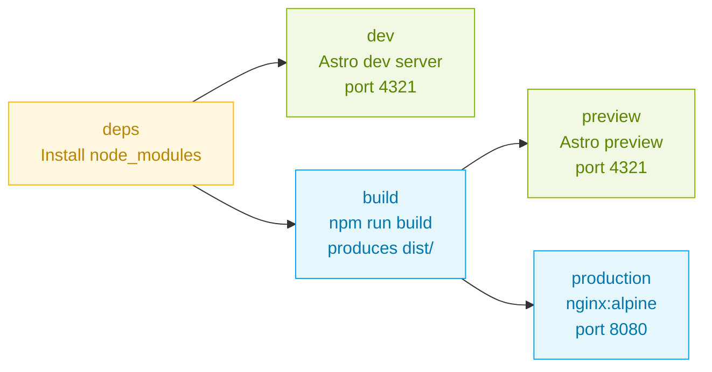

# Local Development Guide

> Run the Agentic SDLC Personas site locally with Docker Desktop. Three profiles, one Makefile, zero host dependencies beyond Docker.

[Root README](./README.md) · [Style Guide](./docs/STYLE_GUIDE.md) · [MCP Catalog](./docs/registry/mcp-catalog.md)

## Sumário

1. [Prerequisites](#1-prerequisites)
2. [Docker profiles at a glance](#2-docker-profiles-at-a-glance)
3. [Run with Make](#3-run-with-make)
4. [Run with docker compose](#4-run-with-docker-compose)
5. [Architecture of the Dockerfile](#5-architecture-of-the-dockerfile)
6. [Native Node (without Docker)](#6-native-node-without-docker)
7. [Troubleshooting](#7-troubleshooting)

## 1. Prerequisites

One of the two paths below is required:

- **Recommended**: [Docker Desktop](https://www.docker.com/products/docker-desktop/) running and healthy, plus `make` (preinstalled on macOS and Linux)
- **Alternative**: Node 20 or 22, npm 10

Verify Docker is running:

```bash
docker info | head -5
```

## 2. Docker profiles at a glance

The repository ships with a single `docker-compose.yml` using three profiles. Each profile is designed for a specific scenario.

| Profile | Scenario | Port | URL |
|---------|----------|------|-----|
| `dev` | Astro dev server with hot reload, edit files and see changes | 4321 | http://localhost:4321 |
| `preview` | Built Astro app served via `astro preview` | 4322 | http://localhost:4322 |
| `prod` | Static dist served by nginx (simulates GitHub Pages) | 8080 | http://localhost:8080/agentic-sdlc-personas/ |

All three map to the same repository. They differ only in the Dockerfile target and the serving strategy.

## 3. Run with Make

The shortest path. Every target below wraps a docker compose command.

```bash
# Dev (hot reload)
make dev

# Production preview via Astro preview
make preview

# Production via nginx (closest to GitHub Pages)
make prod

# Build static dist without serving
make build

# Stop all containers
make down

# Tail logs
make logs

# Show running services
make ps

# Remove built images and clear cache
make clean

# Help
make help
```

## 4. Run with docker compose

Equivalent to the Make targets. Use this when you need extra flags.

```bash
# Dev
docker compose --profile dev up --build

# Preview
docker compose --profile preview up --build

# Production
docker compose --profile prod up --build

# Build-only (no server)
docker compose --profile build run --rm build

# Stop
docker compose down --remove-orphans
```

## 5. Architecture of the Dockerfile

The Dockerfile in `site/Dockerfile` is multi-stage with five stages. Each stage has a single responsibility.



| Stage | Base image | Purpose |
|-------|------------|---------|
| `deps` | `node:20-alpine` | Install npm dependencies, cached layer |
| `dev` | `node:20-alpine` | Astro dev server with hot reload |
| `build` | `node:20-alpine` | Run `npm run build` and generate Pagefind index |
| `preview` | `node:20-alpine` | Serve the built dist via `astro preview` |
| `production` | `nginx:alpine` | Serve static dist through nginx with cache headers, security headers, gzip |

The production image copies only `dist/` from the build stage, so the final image is small and contains no Node runtime.

## 6. Native Node (without Docker)

If you prefer Node on the host, the same commands work.

```bash
cd site
npm install

# Dev
npm run dev
# Open http://localhost:4321

# Build
npm run build

# Preview the built site
npm run preview
# Open http://localhost:4321
```

## 7. Troubleshooting

### Port already in use

If 4321, 4322, or 8080 is busy, stop the offending process or remap in `docker-compose.yml`.

```bash
# See what is listening on a port (macOS)
lsof -i :4321
```

### Hot reload not firing on macOS

The `dev` service sets `CHOKIDAR_USEPOLLING=true`, which is the macOS-safe default for volume-mounted file watchers. If reload is still slow, check that Docker Desktop has the repository folder in its file sharing list.

### Browser shows blank page or 404 in production profile

The Astro site is configured with `base: '/agentic-sdlc-personas'`. In the nginx production profile, always open [http://localhost:8080/agentic-sdlc-personas/](http://localhost:8080/agentic-sdlc-personas/), not the bare root.

### Build fails with ENOSPC

The container ran out of disk space. Prune Docker:

```bash
docker system prune -a --volumes
```

### Need to rebuild from scratch

```bash
make clean
make dev
```

---

Paula Silva, AI-Native Software Engineer · [@paulasilvatech](https://github.com/paulasilvatech) · [agenticdevops.platform.com](https://agenticdevops.platform.com)
