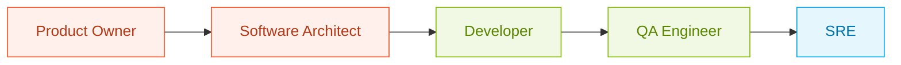

# Style Guide

> Editorial contract for every `.md` file in this repository. Any document that deviates is either fixed or rejected in review.

[Back to docs index](./en/index.md) · [Contributing](../CONTRIBUTING.md) · [MCP Catalog](./registry/mcp-catalog.md)

## Change log

| Version | Date | Author | Changes |
|---------|------|--------|---------|
| 1.0.0 | 2026-04-23 | Paula Silva | Initial style guide aligned with paulasilvatech Design System |

## Sumário

1. [Design system reference](#1-design-system-reference)
2. [Frontmatter contract](#2-frontmatter-contract)
3. [Structure of a persona document](#3-structure-of-a-persona-document)
4. [Navigation](#4-navigation)
5. [Icons policy](#5-icons-policy)
6. [Colors and highlights](#6-colors-and-highlights)
7. [Typography in prose](#7-typography-in-prose)
8. [Lists and tables](#8-lists-and-tables)
9. [Code blocks](#9-code-blocks)
10. [Diagrams, SVG, and images](#10-diagrams-svg-and-images)
11. [Hyperlinks and references](#11-hyperlinks-and-references)
12. [Terminology](#12-terminology)
13. [Accessibility](#13-accessibility)
14. [Anti-patterns](#14-anti-patterns)

## 1. Design system reference

This repository follows the [paulasilvatech Design System](https://github.com/paulasilvatech). All visual output (SVG, icons, diagrams, flows, architecture) uses the canonical palette and typography:

| Layer | Role | Token | Hex |
|-------|------|-------|-----|
| Infra | Foundations, runtime | `--c-blue-500` | `#00A4EF` |
| Platform | Capability, enablement | `--c-green-500` | `#7FBA00` |
| Context | Knowledge, data, memory | `--c-yellow-500` | `#FFB900` |
| Intent | Governance, spec, purpose | `--c-red-500` | `#F25022` |
| Neutral | Everything else | `--ink` | `#1A1A1A` |

Body font: **Inter**. Code and metadata: **JetBrains Mono**. Heading weight: 500.

## 2. Frontmatter contract

Every `.md` file in `docs/`, every persona kit `README.md`, and every persona kit `PERSONA.md` must start with YAML frontmatter.

**Required fields**:

```yaml
---
title: "Human-readable title"
description: "One-sentence summary used by the site and social cards"
author: "Paula Silva, AI-Native Software Engineer, Americas Global Black Belt at Microsoft"
date: "2026-04-23"
version: "1.0.0"
status: "draft" | "approved" | "archived"
locale: "en" | "pt-br" | "es"
tags: ["tag1", "tag2"]
---
```

**Additional fields for persona documents**:

```yaml
persona_id: "22-developer"
sdlc_phase: "Implementation"
cluster: "build"
previous: "21-dba"
next: "23-tech-writer"
reading_time: 18
```

**Additional fields for chapters (Astro content collection)**:

```yaml
chapter: 22
slug: "developer"
accent: "green"
```

## 3. Structure of a persona document

Every persona document in `docs/<locale>/personas/NN-slug.md` follows this canonical structure.

### Document skeleton

```
<frontmatter>

# <inline-svg-icon> <Persona Name>

> One-sentence positioning statement.

<navigation header>

## Change log

## Sumário (1-14)

## 1. Executive summary
## 2. Role and responsibilities
## 3. Jobs to be done
## 4. Pain points before AI-native
## 5. AI-native daily workflow
## 6. Recommended primitives
## 7. Validated MCPs
## 8. Real examples
## 9. Anti-patterns
## 10. KPIs and impact metrics
## 11. Maturity in four levels
## 12. Integration with other personas
## 13. Glossary
## 14. References

<navigation footer>

<footer attribution>
```

### Section minimums

| Section | Minimum content |
|---------|----------------|
| 1. Executive summary | 3 sentences: what the persona does, SDLC phase, primary outputs |
| 2. Role and responsibilities | One analogy plus bulleted list of responsibilities |
| 3. Jobs to be done | At least 5 jobs in user-story form |
| 4. Pain points | At least 4 concrete pre-AI pain points |
| 5. Workflow | Step-by-step daily routine using Copilot and Claude Code |
| 6. Primitives | Separate subsections for agents, prompts, instructions, skills, hooks |
| 7. MCPs | Table with name, status, link (matching the catalog) |
| 8. Examples | At least 2 end-to-end scenarios with input and expected output |
| 9. Anti-patterns | At least 3 anti-patterns with mitigation |
| 10. KPIs | DORA, SPACE, or persona-specific metrics with baseline and target |
| 11. Maturity | 4 levels from manual to agentic with concrete markers |
| 12. Integration | Mermaid diagram of handoff with adjacent personas |
| 13. Glossary | At least 5 terms used in the document |
| 14. References | At least 6 references, all as descriptive hyperlinks |

## 4. Navigation

Every persona document has a navigation block at the top and the bottom.

```
[← Previous: <Name>](./<prev-slug>.md) · [↑ Index](../index.md) · [Next: <Name> →](./<next-slug>.md)
```

Chapters are numbered 01 through 24. The document for `22-developer` has:

- previous: `21-dba`
- next: `23-tech-writer`

Non-persona documents use a simpler navigation: `[Back to docs index](...)`.

## 5. Icons policy

**Icons are only allowed in the H1 of a document.** Every persona document H1 includes an inline SVG icon that visually identifies the persona. The icon is 28 pixels tall, uses the DS palette, and aligns vertically with the title.

```markdown
# <svg width="28" height="28">...</svg> Developer
```

**Not allowed**:

- Emoji or icons in body headings (H2, H3, H4)
- Emoji in lists, tables, or inline text
- Decorative emoji as visual separators

This rule is enforced by `scripts/validate_md.py`.

## 6. Colors and highlights

Use color for semantic emphasis, not decoration. Available mechanisms in markdown:

### Inline badges via HTML

For status badges or layer markers, use HTML span with a DS class (rendered by the Astro site):

```html
<span class="badge badge--green">platform</span>
<span class="badge badge--blue">infra</span>
<span class="badge badge--yellow">context</span>
<span class="badge badge--red">intent</span>
```

### Blockquotes

Use blockquotes for positioning statements, key insights, or pull quotes. One per section maximum.

### Callouts

For critical warnings, tips, or notes, use this HTML pattern which renders with DS styling:

```html
<aside class="callout callout--tip">
  <strong>Tip.</strong> Body of the callout.
</aside>
```

Variants: `callout--tip`, `callout--warn`, `callout--danger`, `callout--info`.

## 7. Typography in prose

- Sentence case for every heading
- No em dashes ever. Use comma, period, colon, or middle dot
- ISO dates: `2026-04-23`, never `April 23, 2026`
- Full product names: "GitHub Copilot" not "Copilot", "Microsoft Azure" not "Azure" on first mention, "Claude Code" not "Claude"
- Numbers below ten spelled out in prose, numerals for ten and above
- Oxford comma in lists

## 8. Lists and tables

### Lists

CommonMark requires a blank line before any list. Lists are used for:

1. Numbered procedures (always numbered)
2. Bulleted enumerations of at least 3 items
3. Never for 1-2 items (use a sentence)

Bullet items should be at least one full sentence when they are the main content of a section.

### Tables

Tables have:

- A first row of headers in sentence case
- No merged cells (not supported in CommonMark)
- No em dashes; use commas
- All columns must be filled; use `n/a` if truly empty

Table caption (optional) goes above the table as italicized text.

## 9. Code blocks

Every code block declares its language. Use:

```yaml
# yaml for frontmatter and configs
```

```typescript
// typescript for TS/Astro
```

```bash
# bash for shell commands
```

```jsonc
// jsonc for JSON with comments (mcp.json, hooks.json)
```

For ghost text in Copilot examples, use:

```typescript
const agent = new Agent({
  model: 'gpt-4o',
  // suggestion: tools: [searchTool, codeTool],
});
```

## 10. Diagrams, SVG, and images

All visual assets live under `assets/`:

```
assets/
├── icons/personas/<NN-slug>.svg
├── diagrams/<name>.svg
├── diagrams/<name>.mermaid
└── images/<name>.<ext>
```

### SVG

- Follow the paulasilvatech Design System palette
- Use layer colors for layer meaning (never for decoration)
- ASCII IDs only (no accents, no spaces)
- Include a `<title>` element for accessibility
- No inline emoji

### Mermaid

Every Mermaid diagram has layer colors applied to nodes. Example:



### Images

- PNG or WebP only for raster
- Always include descriptive alt text
- Max width 1600 pixels
- Use relative paths from the file

## 11. Hyperlinks and references

- **Never** use bare URLs. Always wrap in descriptive anchor text
- Prefer official sources: product documentation, GitHub organization blogs, Microsoft Learn, Anthropic docs
- Research references must prioritize Aug 2025 to 2026. If outside this range, flag explicitly: "Most recent available: `<date>`"
- References section uses this format:

```markdown
## 14. References

- [Descriptive title](https://url) — one-line context why this reference matters
```

## 12. Terminology

| Preferred | Avoid |
|-----------|-------|
| GitHub Copilot | Copilot |
| Microsoft Azure | Azure (on first mention) |
| Claude Code | Claude (when referring to the CLI/agent) |
| Microsoft Agent Framework | MAF |
| Agentic DevOps | DevOps AI |
| Spec-Driven Development | SDD (on first mention expand) |
| Model Context Protocol | MCP (on first mention expand) |
| AGENTS.md | agents file |

## 13. Accessibility

Every document must:

- Follow semantic heading order (H1, then H2, then H3, never skip)
- Provide alt text for every image
- Provide a title element for every SVG
- Use descriptive link text (not "click here" or "read more")
- Ensure color is never the only signal (pair color with text labels)
- Comply with WCAG 2.1 AA for contrast in any HTML component

## 14. Anti-patterns

These are automatically flagged or rejected in review:

1. H1 without a persona icon (persona documents only)
2. Missing frontmatter
3. Missing or truncated Sumário
4. Missing previous / next navigation
5. Bare URLs or undescriptive anchor text
6. Em dashes in prose
7. Emoji in body headings or text
8. Mixed locales in a single document
9. MCP recommendation that is not in [`mcp-catalog.md`](./registry/mcp-catalog.md)
10. Invented statistics without source citation

---

[Back to docs index](./en/index.md) · [Contributing](../CONTRIBUTING.md) · [MCP Catalog](./registry/mcp-catalog.md)

Paula Silva, AI-Native Software Engineer · [@paulasilvatech](https://github.com/paulasilvatech) · [agenticdevops.platform.com](https://agenticdevops.platform.com)
