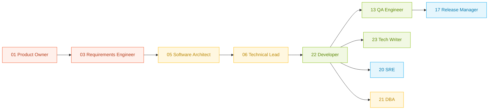

# <svg xmlns="http://www.w3.org/2000/svg" viewBox="0 0 64 64" width="28" height="28" style="vertical-align:-6px;"><rect x="1.5" y="1.5" width="61" height="61" rx="10" ry="10" fill="#F1F8E3" stroke="#7FBA00" stroke-width="1.2"/><path d="M22 18 L12 32 L22 46" fill="none" stroke="#1A1A1A" stroke-width="3" stroke-linecap="round" stroke-linejoin="round"/><path d="M42 18 L52 32 L42 46" fill="none" stroke="#1A1A1A" stroke-width="3" stroke-linecap="round" stroke-linejoin="round"/><line x1="37" y1="16" x2="27" y2="48" stroke="#7FBA00" stroke-width="3" stroke-linecap="round"/><circle cx="32" cy="32" r="3.2" fill="#FFB900" stroke="#1A1A1A" stroke-width="1"/></svg> Developer

> The Developer is the persona that writes, fixes, and evolves code. In an AI-native SDLC, the Developer operates a stack of validated primitives, not a code editor.

[← Previous: DBA](./21-dba.md) · [↑ Index](../index.md) · [Next: Tech Writer →](./23-tech-writer.md)

## Change log

| Version | Date | Author | Changes |
|---------|------|--------|---------|
| 1.0.0 | 2026-04-23 | Paula Silva | Initial persona document aligned with Agentic SDLC Personas v1.0.0 |

## Sumário

1. [Executive summary](#1-executive-summary)
2. [Role and responsibilities](#2-role-and-responsibilities)
3. [Jobs to be done](#3-jobs-to-be-done)
4. [Pain points before AI-native](#4-pain-points-before-ai-native)
5. [AI-native daily workflow](#5-ai-native-daily-workflow)
6. [Recommended primitives](#6-recommended-primitives)
7. [Validated MCPs](#7-validated-mcps)
8. [Real examples](#8-real-examples)
9. [Anti-patterns](#9-anti-patterns)
10. [KPIs and impact metrics](#10-kpis-and-impact-metrics)
11. [Maturity in four levels](#11-maturity-in-four-levels)
12. [Integration with other personas](#12-integration-with-other-personas)
13. [Glossary](#13-glossary)
14. [References](#14-references)

## 1. Executive summary

The Developer turns an approved specification into working, tested, reviewed code that ships to production. In an AI-native SDLC, the Developer operates inside the Implementation phase with a fixed set of primitives: one implementation agent, four slash prompts, scoped instructions, schema-validated hooks, and a curated list of validated MCPs. The primary outputs are code changes, passing test suites, pull requests with traceable context, and updated documentation.

## 2. Role and responsibilities

Think of the Developer like a structural engineer on a construction site. The architect hands over drawings that satisfy the zoning constraints. The engineer does not rewrite the drawings, but they also do not execute them mechanically: they choose the concrete mix, the rebar layout, and the sequence of pours that make the structure stand up. In an AI-native SDLC the specification, architecture decisions, and acceptance criteria are upstream artifacts, and the Developer is accountable for translating them into code that survives production without rework.

Primary responsibilities:

- Implement features described in `SPECIFICATION.md` using the EARS requirements and Given-When-Then acceptance criteria
- Practice Test-Driven Development end-to-end, starting from the failing test suggested by the spec
- Fix bugs with the understand-reproduce-fix-verify loop, never jumping to the fix
- Review code from peers and AI agents with equal rigor
- Update the `CODEMAP.md` and developer docs whenever a public API changes
- Keep dependency hygiene, resolve vulnerabilities within SLA
- Operate the Implementer agent and the `/implement`, `/fix-bug`, `/tdd`, `/refactor` prompts

## 3. Jobs to be done

1. As a Developer, I want to convert an approved spec into a merged pull request within one working day, so that the team keeps a daily delivery cadence.
2. As a Developer, I want the AI agent to write the failing test first, so that every feature has a machine-verifiable acceptance criterion.
3. As a Developer, I want to reproduce a production bug in a local test, so that the fix is protected against regression.
4. As a Developer, I want to refactor without changing behavior, so that the code base stays coherent as it grows.
5. As a Developer, I want the PR description to be auto-generated from my changes, so that reviewers have full context without asking me.
6. As a Developer, I want to know which dependency upgrade will break which test, so that security patches land without manual triage.

## 4. Pain points before AI-native

1. **Spec drift**. The feature in the ticket is not the feature that shipped. Without a machine-readable spec linked to tests, every sprint silently redefines scope.
2. **Copy-paste debugging**. Bugs are fixed by pattern matching on the stack trace instead of by reproducing the root cause. The same class of bug returns every quarter.
3. **Review fatigue**. Reviewers cannot hold the whole system in their head, so they rubber-stamp or nitpick, never both at the same time.
4. **Test gaps invisible until production**. Coverage reports lie because they count lines, not branches or behaviors. Risk lives in the untested 15 percent.
5. **Documentation lag**. The `README.md` and API docs describe last quarter's architecture. New team members ramp slowly and ask senior engineers the same questions every week.

## 5. AI-native daily workflow

The Developer operates a fixed loop each day. The loop uses GitHub Copilot primitives inside Visual Studio Code and Claude Code at the terminal, plus a small catalog of validated MCPs for external context.

### 5.1 Morning setup

1. Pull the latest `main` and rebase the feature branch.
2. Open the repo in Visual Studio Code. GitHub Copilot Chat loads the `AGENTS.md` and the scoped `.github/instructions/*.instructions.md`.
3. Run `/audit-context` from the Technical Lead kit (installed as a dependency) to confirm the context budget is under threshold.
4. Read the active ticket, open the linked `SPECIFICATION.md`, confirm the EARS requirements and acceptance criteria.

### 5.2 Core work cycle

Each work cycle is a single unit of change, typically 1 to 4 hours of focused work.

1. **Spec to failing test**. Invoke `/tdd` with the acceptance criteria. The Implementer agent writes a failing test that encodes the Given-When-Then and refuses to proceed until the test is committed.
2. **Implement**. Invoke `/implement`. The agent writes the minimum code to pass the failing test. Copilot inline completions handle boilerplate; the developer owns decisions.
3. **Self-review**. Run the test suite, lint, type-check. If any hook fires, fix before moving on. Hooks are zero-token governance.
4. **Refactor**. Invoke `/refactor` to improve structure without changing behavior. The agent runs the test suite before and after to prove behavioral equivalence.
5. **Pull request**. The PR description is composed from the commit messages and the linked spec. Copilot Code Review and the Quality Reviewer agent scan the diff.

### 5.3 Bug cycle

When a bug is reported, the Developer invokes `/fix-bug`, which runs the understand-reproduce-fix-verify loop:

1. **Understand**. Read the error, the stack trace, and the related code. The agent summarizes the hypothesis.
2. **Reproduce**. Write a failing test that reproduces the bug. No fix is allowed before this step.
3. **Fix**. Minimum change to make the failing test pass.
4. **Verify**. Run the full test suite, not just the new test. Confirm no regression.

### 5.4 End of day

1. Push the branch. GitHub Actions runs the CI pipeline.
2. Update the ticket with the link to the PR and the tests that encode the acceptance criteria.
3. If the feature touched a public API, verify the `CODEMAP.md` and the generated docs are up to date.

## 6. Recommended primitives

### 6.1 Agents

| Agent | File | Purpose |
|-------|------|---------|
| `implementer` | `.github/agents/implementer.agent.md` | Implementation, TDD, bug fixing with understand-reproduce-fix-verify |

The Implementer agent uses `claude-sonnet-4-6` by default. It holds tools `read`, `edit`, `search`, `grep`, `glob`, `bash`. Extended thinking is disabled because iterative implementation tasks lose quality with deep think loops.

### 6.2 Prompts

| Command | File | Purpose |
|---------|------|---------|
| `/implement` | `.github/prompts/implement.prompt.md` | Implement a feature against a spec, minimum code to pass the test |
| `/fix-bug` | `.github/prompts/fix-bug.prompt.md` | Four-step bug fix loop, never skips reproduction |
| `/tdd` | `.github/prompts/tdd.prompt.md` | Write the failing test first, enforced |
| `/refactor` | `.github/prompts/refactor.prompt.md` | Behavior-preserving structural improvement |

### 6.3 Instructions

Scoped `applyTo` reduces token cost by approximately 68 percent compared to global instructions.

| Scope (`applyTo`) | File | Purpose |
|-------------------|------|---------|
| `src/**/*.ts,src/**/*.tsx` | `.github/instructions/typescript.instructions.md` | TypeScript conventions, strict mode, no `any` |
| `tests/**/*` | `.github/instructions/tests.instructions.md` | AAA pattern, meaningful names, no brittle snapshots |
| `**/*.sql` | `.github/instructions/sql.instructions.md` | Migrations are up-and-down, no schema drift |

### 6.4 Skills

Skills are lazy-loaded, so the developer can install many and pay tokens only for the ones that trigger.

- `tdd-enforcer`: refuses to write implementation code if the failing test is missing
- `dep-risk-scan`: calls Snyk MCP on every dependency upgrade

### 6.5 Hooks

Hooks cost zero LLM tokens. They are the strongest governance layer.

- `pre-commit`: lint, type-check, secret scan
- `post-commit`: regenerate `CODEMAP.md` if public API surfaces changed
- `pre-push`: run the fast test lane

## 7. Validated MCPs

Every MCP below appears in [`docs/registry/mcp-catalog.md`](../../registry/mcp-catalog.md). Do not reference any MCP that is not in the catalog.

| MCP | Status | Use in this persona | Official link |
|-----|--------|---------------------|---------------|
| GitHub MCP Server | Official | Read the repo, manage PRs and issues, read Actions runs | [github/github-mcp-server](https://github.com/github/github-mcp-server) |
| Microsoft Learn Docs MCP | Official | Fetch current Microsoft documentation when implementing on Azure stacks | [microsoftdocs/mcp](https://github.com/microsoftdocs/mcp) |
| Sentry MCP Server | Official | Pull the error context into the fix-bug loop | [getsentry/sentry-mcp](https://github.com/getsentry/sentry-mcp) |
| Snyk MCP Server | Official | Check vulnerabilities on dependency upgrade and during refactor | [docs.snyk.io · Snyk MCP](https://docs.snyk.io/scan-with-snyk/snyk-mcp) |
| Linear MCP Server | Official | Read the active ticket, update the issue after PR merge | [linear.app/docs/mcp](https://linear.app/docs/mcp) |
| Figma Dev Mode MCP | Official | Pull design tokens and component specs when implementing UI features | [developers.figma.com/docs/figma-mcp-server](https://developers.figma.com/docs/figma-mcp-server/) |
| Playwright MCP | Official (Microsoft) | Drive end-to-end tests against the running feature | [microsoft/playwright-mcp](https://github.com/microsoft/playwright-mcp) |

## 8. Real examples

### 8.1 Scenario A: implement a new endpoint

**Input**: `SPECIFICATION.md` contains the EARS requirement `WHEN a user submits a rental claim with a valid contract ID, THE system SHALL return the claim status within 300 ms.`

**Invocation**: `/tdd` followed by `/implement`.

**Expected output**:

1. A failing integration test `tests/claims/returns-status-under-300ms.spec.ts` that asserts response time and payload shape.
2. A new route handler `src/claims/status.controller.ts` with minimal code to pass the test.
3. A PR titled `feat(claims): return claim status within 300 ms` linked to the spec section and the new test.

### 8.2 Scenario B: fix a production bug

**Input**: A Sentry alert reports a null pointer in `ContractService.findById` triggered by concurrent requests.

**Invocation**: `/fix-bug`.

**Expected output**:

1. A failing unit test `tests/contracts/find-by-id-concurrency.spec.ts` that reproduces the race condition.
2. A fix in `ContractService` that introduces optimistic locking, with no other behavioral change.
3. A PR titled `fix(contracts): eliminate race in ContractService.findById` linked to the Sentry issue and the new test.
4. A post-merge Sentry issue resolution with the PR URL recorded.

### 8.3 Scenario C: behavior-preserving refactor

**Input**: A monolithic `orders.service.ts` of 1,200 lines needs to be split into cohesive modules.

**Invocation**: `/refactor`.

**Expected output**:

1. The full test suite runs green before the refactor.
2. `orders.service.ts` is split into `orders/pricing.ts`, `orders/validation.ts`, `orders/persistence.ts` with identical public surface.
3. The full test suite runs green after the refactor.
4. A PR titled `refactor(orders): split service into pricing, validation, persistence` with a diff summary and a test parity report.

## 9. Anti-patterns

1. **Skipping the failing test**. Writing the implementation first and adding a test that happens to pass defeats TDD. Mitigation: the `tdd-enforcer` skill refuses to generate implementation code when no failing test exists.
2. **Trusting coverage percentage as the signal for quality**. Line coverage is a vanity metric. Mitigation: track mutation score or branch coverage, and include negative-path assertions in every test file.
3. **Letting Copilot choose naming without context**. Names hallucinated from patterns outside the repo produce inconsistent code. Mitigation: scope instructions with `applyTo` and teach Copilot the domain vocabulary.
4. **One-shot large refactors**. Refactors that touch dozens of files at once cannot be reviewed safely. Mitigation: split into a sequence of small, behavior-preserving commits, each green on the test suite.
5. **Ignoring hooks**. A pre-commit hook that fails is a gift, not a blocker. Mitigation: treat hook output as the first review; fix before committing.

## 10. KPIs and impact metrics

The Developer persona is evaluated with a mix of DORA, SPACE, and Agentic DevOps metrics.

| Metric | Baseline (manual) | Target (agentic) | Measurement |
|--------|-------------------|------------------|-------------|
| PR lead time | 3 days | < 1 day | GitHub API |
| Deployment frequency | Weekly | Multiple per day | GitHub Deployments |
| Change failure rate | 20 percent | < 5 percent | Sentry or incidents post deploy |
| Mean time to restore | 4 hours | < 1 hour | Incident tracker |
| Test suite reliability | 85 percent | > 99 percent | Flake rate |
| Mutation score | Unknown | > 70 percent | Stryker, Pitest, or equivalent |
| Rework rate | 30 percent | < 10 percent | Percent of merged code rewritten within 30 days |
| Token efficiency | N/A | < 1M tokens per merged PR | Copilot usage report |

## 11. Maturity in four levels

| Level | Name | Markers |
|-------|------|---------|
| L1 | Manual | Copy-paste from Stack Overflow, no standard prompt, no scoped instructions, no MCPs |
| L2 | Assisted | GitHub Copilot autocomplete only, no agent, `AGENTS.md` missing or generic |
| L3 | Augmented | One Implementer agent, four slash prompts, scoped instructions, one or two MCPs, TDD workflow |
| L4 | Agentic | Full primitives kit, hooks enforced, validated MCPs in the catalog only, PR narrative auto-generated, maturity scorecard above 80 percent |

## 12. Integration with other personas

Handoffs:

- **From Technical Lead**: routing table, scoped instructions, `AGENTS.md`, project baseline
- **From Software Architect**: `CODEMAP.md`, `IMPLEMENTATION_PLAN.md` with parallel markers, API contracts
- **To QA Engineer**: merged PR with passing tests, test matrix updated
- **To Tech Writer**: updated `CODEMAP.md`, new public API surfaces, changelog entry
- **To SRE**: deployment-ready artifact, feature flag configuration, runbook updates

## 13. Glossary

- **Agent**: a configured LLM role with tools, instructions, and a defined output shape. Lives in `.github/agents/<name>.agent.md`.
- **Prompt**: a reusable slash command that invokes an agent with a specific task. Lives in `.github/prompts/<name>.prompt.md`.
- **Instructions**: scoped guidance applied by pattern match on file paths via `applyTo`. Lives in `.github/instructions/<name>.instructions.md`.
- **Skill**: a lazy-loaded capability that activates on keyword match. Costs tokens only when triggered.
- **Hook**: a zero-token rule enforced at a specific lifecycle event (pre-commit, post-commit, pre-push, pre-merge).
- **MCP**: Model Context Protocol server that exposes external systems (GitHub, Sentry, Linear, etc.) to the agent.
- **EARS**: Easy Approach to Requirements Syntax. Format used in `SPECIFICATION.md`.
- **TDD**: Test-Driven Development. Write the failing test first, then the minimum code to pass it.
- **CODEMAP**: A generated document that describes the program skeleton for the LLM and for humans.

## 14. References

- [GitHub Copilot documentation](https://docs.github.com/en/copilot) — authoritative source for Copilot features, agent mode, and instructions
- [Claude Code overview](https://docs.claude.com/en/docs/claude-code) — Anthropic's agentic CLI used for long-running tasks
- [Spec-Kit open source reference](https://github.com/github/spec-kit) — spec-driven development scaffolding
- [Model Context Protocol specification](https://modelcontextprotocol.io/) — the protocol that binds agents to external systems
- [Effective context engineering for AI agents, Anthropic](https://www.anthropic.com/engineering/effective-context-engineering-for-ai-agents) — canonical guidance for token-efficient agent design
- [DORA metrics research](https://dora.dev/research/) — the empirical foundation behind four key metrics for software delivery
- [SPACE framework, Microsoft Research](https://dl.acm.org/doi/10.1145/3454122.3464933) — developer productivity dimensions beyond velocity
- [Keep a Changelog](https://keepachangelog.com/en/1.1.0/) — changelog format adopted by this framework

---

[← Previous: DBA](./21-dba.md) · [↑ Index](../index.md) · [Next: Tech Writer →](./23-tech-writer.md)

Paula Silva, AI-Native Software Engineer · [@paulasilvatech](https://github.com/paulasilvatech) · [agenticdevops.platform.com](https://agenticdevops.platform.com)
